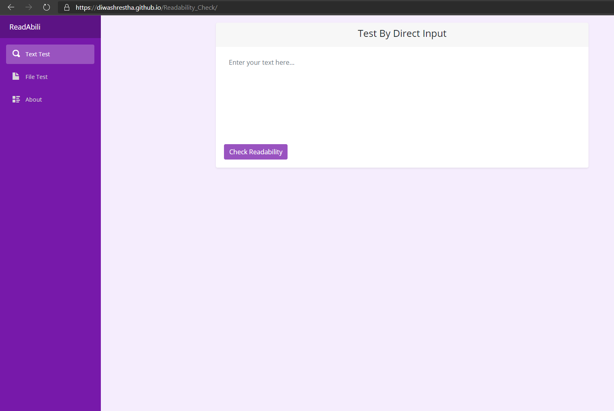

# Readability_Check
This is a tool which will find the Readability score, grade and age required to understand the given text.

## Technologies
Project is created with:
* C#
* Blazor
* Github Action
* Github Page

To use this tool , go to : [Github Page](https://diwashrestha.github.io/Readability_Check/)

## ScreenShot
### Text Test

### File Test

