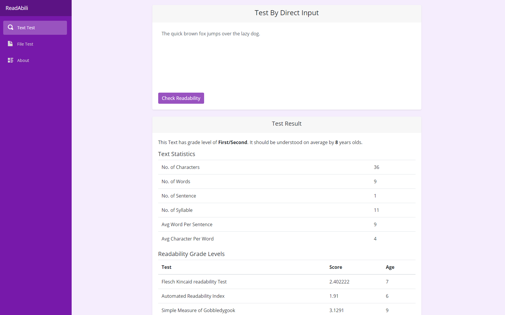
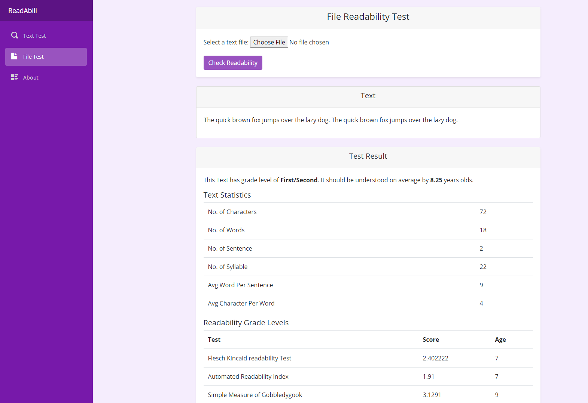

# Readability Check 📖
This is a tool which will find the Readability score, grade and age required to understand the given text.

### 🖥 [Live Demo](https://diwashrestha.github.io/Readability_Check/)

## Technologies 💻
Project is created with:
* C#
* Blazor Webassembly
* Github Action
* Github Page

## ScreenShot 📷
### Text Test

### File Test

